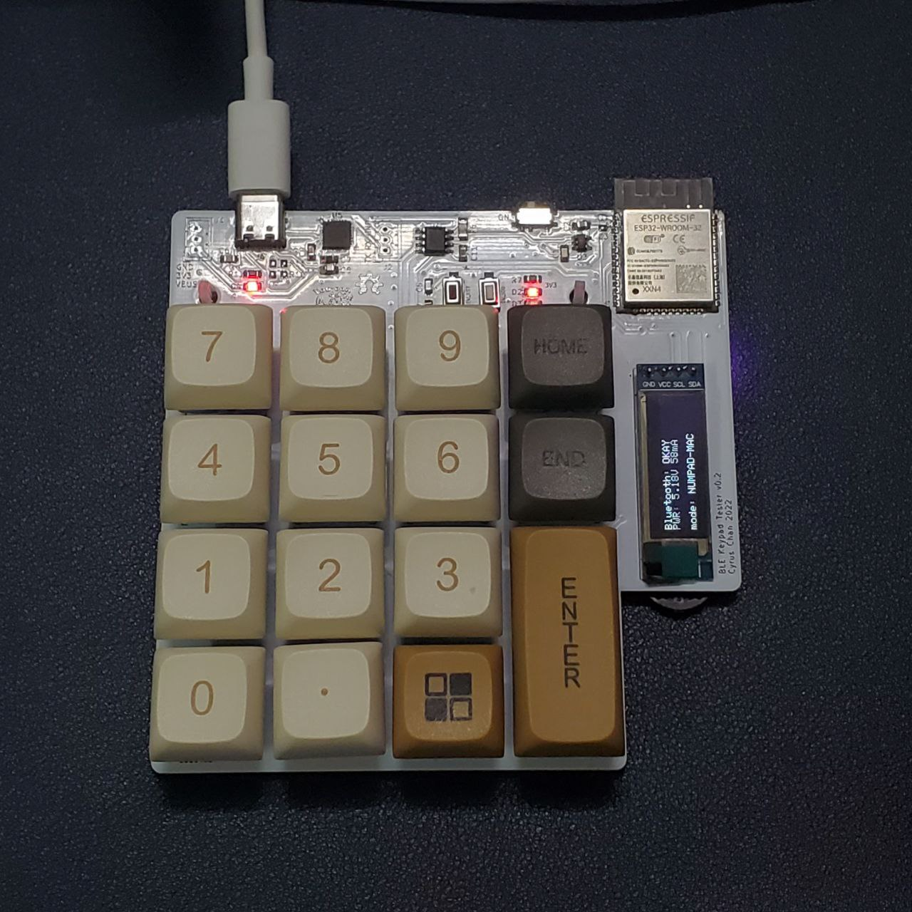
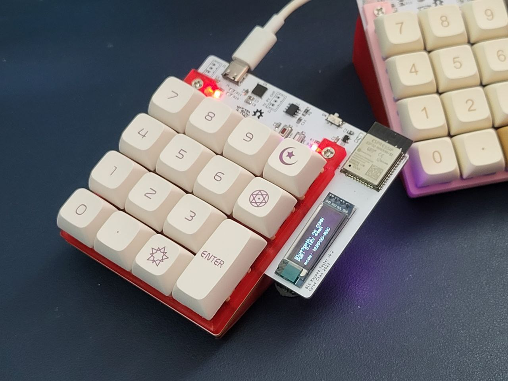
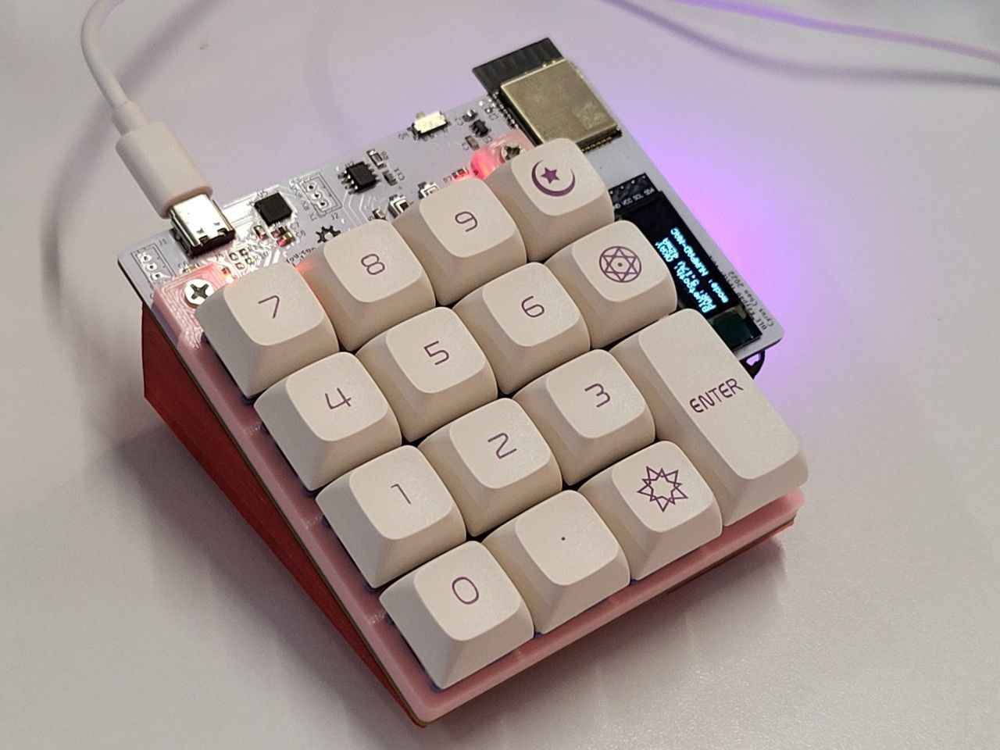
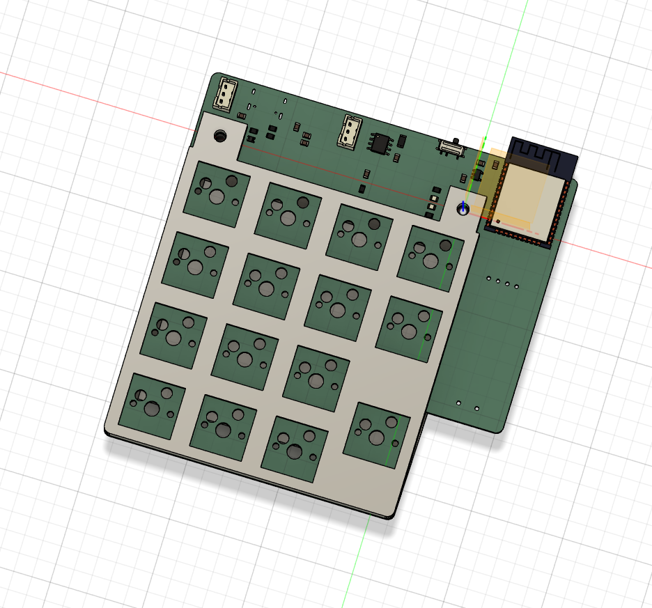
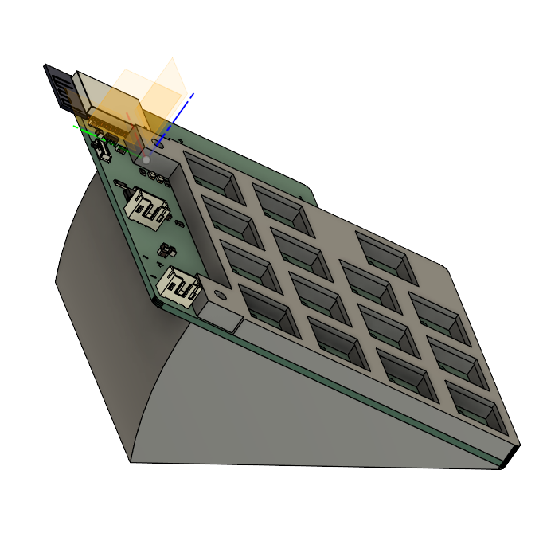

# README.md

A pathfinder PCB for the upcoming Lipo-powered version of ESP32 BLE numpad. Arduino code also attached.

[Schematics PDF](./sch-export.pdf) | [Arduino Code](./arduino-freertos-code/ble_keyboard/ble_keyboard.ino) | [3D model](./3d-models/numpad-case-v10.3mf)

## Showcase

Assembled PCB  

  

Assembled PCB  w/ 3D print parts  

  

  

## 3D-printed Parts

The two 3D printed parts (front plate & base) are fixed to the PCB asembly with 2pcs M3x20 screws.  
The parts are designed in Fusion360, and the exported files can be found at the [3d-models/](./3d-models/) folder.

 

## Known Problems
- ~~USB Type-C CC pins was lay out incorrectly~~ (still testing, maybe a USB cable compat issue)
    - Reason: CC pins should be connected to `GND` with `5.1kΩ` resistor per USB Type-C definition ([link1](https://community.silabs.com/s/article/what-s-the-role-of-cc-pin-in-type-c-solution?language=en_US) [link2](https://community.silabs.com/s/article/legacy-usb-device-detection-by-type-c?language=en_US))
    - Temporary fix: not populating `R10` & `R11`, might led to inability to connect when Type-C plug is flipped
- WS2812 data line `DIN` might be affected my noise
    - Problem: Should add a `500Ω` resistor in series on `DIN` line to improve signal reliability, as per NeoPixel UberGuide
    - Temporary fix: avoid changing CPU frequency scaling on-the-fly, which may affect GPIO line conditions
- TCA8418 IC is not intended to be use with key matrix and diodes
    - Reason: originally designed for (pathfinding) swapping in diode and check the effect of ghosting
    - Temporary fix: populate diode components with `0805 0Ω` resistors
- Hotplug shoe for keyswitch is not strong enough to hold it in place
    - Reason: there is no faceplate to hold/align the keyswitches
    - Temporary fix: use 5-pin version of keyswitches for added stability, use hotglue if necessary
    - **NEW**: use a 3d printed positioning plate uploaded [here](./3d-models/)

Hopefully all issues can be fixed in the next revision to the PCB.

## Credits

I used & referenced a lot from the design from the other open-source projects.  
Here is the list of git repos:  

### KiCAD
- https://github.com/keebio/keebio-components
- https://github.com/keebio/Keebo-Parts.pretty
- https://github.com/perigoso/keyswitch-kicad-library
- https://github.com/ebastler/marbastlib
- https://github.com/AnthonyDiGirolamo/i2c-thumb-keyboard
- https://github.com/gorbachev/KiCad-SSD1306-0.91-OLED-4pin-128x32.pretty
- https://github.com/sparkfun/SparkFun-KiCad-Libraries
- https://github.com/Digi-Key/digikey-kicad-library

### Arduino/FreeRTOS
- https://github.com/kitesurfer1404/WS2812FX
- https://github.com/greiman/SSD1306Ascii
- https://github.com/adafruit/Adafruit_INA219
- https://github.com/adafruit/Adafruit_TCA8418
- https://github.com/espressif/arduino-esp32
- https://www.freertos.org/a00113.html